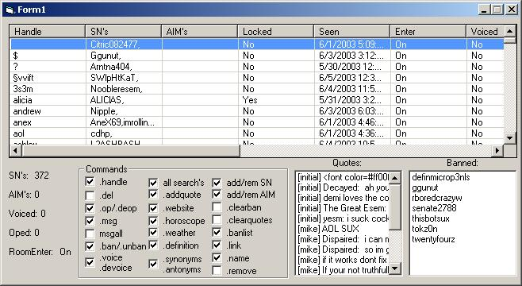



## Info Bot

### Description

It's a nice simple but very effective bot. It has some brand new features never before seen on aol. It features a multi user bot system in which the user will be prompted when he enters the room to type ".handle "your handle", and that's when the fun begins. You can store your contact info on it like your website or AOL screen names and AIM screen names. You can also to many things like look up definitions to words,look up antonyms and synonyms, look up what the weather is like for a zip code, look up the meaning of your name, find out what your daily horoscope is, and much more.
 
### More Info
 

             |
---                |---
**Submitted On**   |2003-08-11 19:30:06
**By**             |[VB Mike](https://github.com/Planet-Source-Code/PSCIndex/blob/master/ByAuthor/vb-mike.md)
**Level**          |Intermediate
**User Rating**    |4.6 (23 globes from 5 users)
**Compatibility**  |VB 4\.0 \(16\-bit\), VB 4\.0 \(32\-bit\), VB 5\.0, VB 6\.0
**Category**       |[Complete Applications](https://github.com/Planet-Source-Code/PSCIndex/blob/master/ByCategory/complete-applications__1-27.md)
**World**          |[Visual Basic](https://github.com/Planet-Source-Code/PSCIndex/blob/master/ByWorld/visual-basic.md)
**Archive File**   |[Info\_Bot1628268122003\.zip](https://github.com/Planet-Source-Code/vb-mike-info-bot__1-45945/archive/master.zip)

